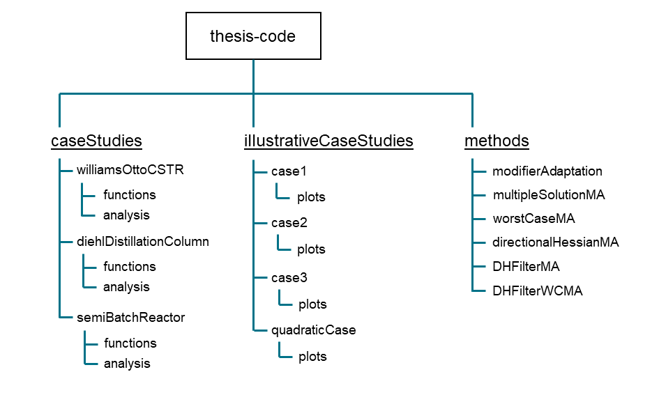

# thesis-code
Complete collection of code relating to the thesis of Alasdair Jack Speakman on real-time optimization via a multiple model approach.

The code is primarily based on using MATLAB (ver. 2020b)

