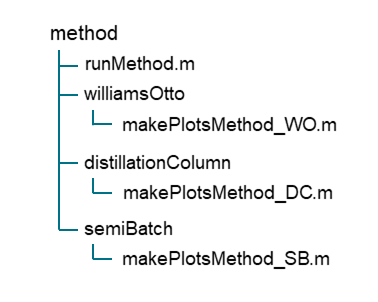

# methods

This folder contains all of the code relating to each method developed over the course of my PhD and presented the thesis (and standard MA)

The general layout of each method is as follows

